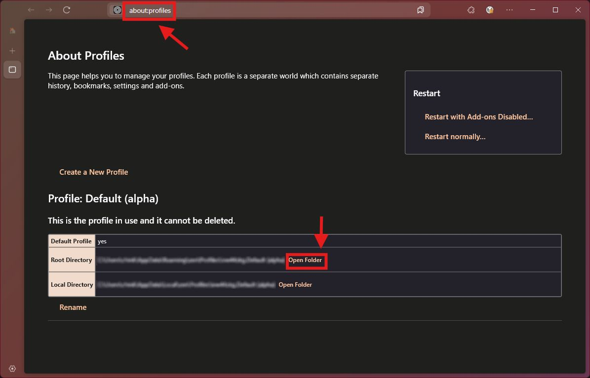
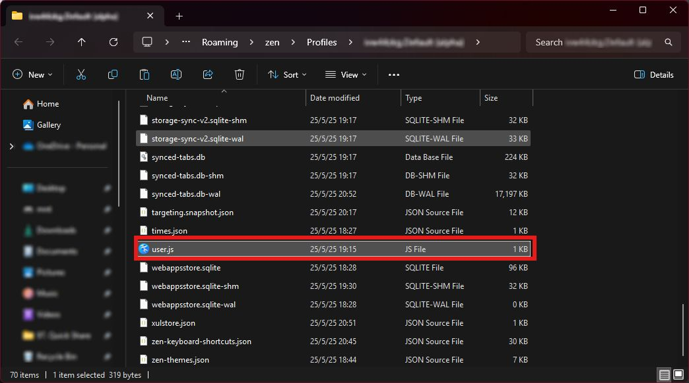

# Uncalmed Zen

> ⚠️ Warning
>
> Enable unsupported features on Zen Browser is not recommended, it could cause certain issues which might not get
> supports by the Official Zen Team. If these features are required, please consider using Firefox instead. Or
> [Floorp](https://floorp.app) is also a decent alternatie

The official release of [Zen Browser](https://zen-browser.app/) have several Firefox features disabled by default, This
is due to their privacy focused goal. However, for the users who found these features useful and want to enable it back,
currently Zen Browser did not provide an easy access settings under the preference page (aka `about:preference`).
Instead, users need to navigate to `about:config` to enable them back. This however, create several issues including
but not limited to:

  - Risk on Misconfigurations: Zen (and Firefox) have lots of flags, sometimes to enable or disable certain features,
    multiple flags need to toggle or modify. This could cause misconfiguration and potentially break the browser.

  - Hard to Configure Multiple Devices: For users who want to use the same set of features, they would need to modify
    these flags device by device, is lots of works and increased the risk of misconfiguration.

  - Most `about:config` Flags Did Not Synced Via Firefox Account: Many `about:config` flags does not sync with the
    Firefox Account, this means that, if the user reinstalled Zen Browser, or reset the browser, loggin back to their
    Firefox Account wont restore these features, manually configure is still required.

Uncalmed Zen is a user.js configs that enable back some claimed to be "unwanted" features, but indeed useful. The
privacy focus aim is understandable but sometimes they could go too extream. While the Zen Team said that they won't
prevent anyone to use these features, an easily accessible settings via the preference page or `about:preference` are
not yet available. The main goal is to make the process of these features back easily, and beter synchronization.

## Reverted Options

The following is a list of flags/ features that currently get reverted by Uncalmed Zen, and the PR/ Issue that
introduced it:

  - AI Chat related stuff: Disabled at PR [#6244](https://github.com/zen-browser/desktop/pull/6244) in response of
    the discussion [#6236](https://github.com/zen-browser/desktop/discussions/6236).

## Installation

Install of Uncalmed Zen is just copy the user.js over to the Zen Browser's profiles where it is currently used. Bellow
are the steps to install it. It is required to download the file `user.js` or clone this repo to local first.

> ℹ️ Information
>
> If another `user.js` have been applied, please refer to their documentations on how to append Uncalmed Zen's `user.js`
> into it instead, eg arkenfox provides a [`user-overrides.js`](https://github.com/arkenfox/user.js/wiki/3.1-Overrides)
> where the customizaions should be placed there.

### 1. Open The Profile Folder

In Zen Browser, navigate to `about:profiles`, this will navigate to a page where it listed all currently avaliable
profiles. If however, no profiles created yet, there will be only one profiles with "Default" in its name.

Under the curretly active profile, which is the profile that mentioned with "This is the profile in use and it cannot
be deleted.", click the "Open Folder" button, which located at the right column of the table row "Root Directory".

### 2. Copy The `user.js` File into The Opened Window

File Explorer (Windows), Finder (MacOS) or the systems default File Manager will then open the Zen Profile's folder
like, for example, the screenshot bellow. Then copy the `user.js` file into it, or optionally, create a symbolic link
to it.

### 3. Restart Zen Browser

For the effects to be taken, simply restart the browser and the config should be applied.
